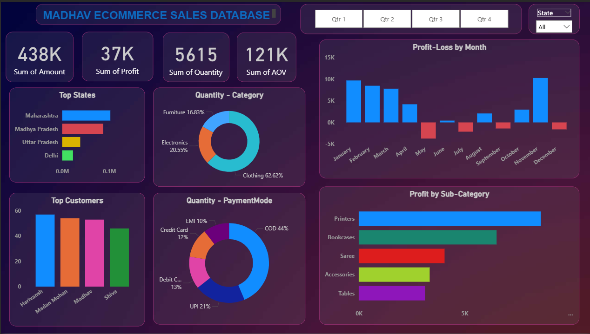

📊 E-commerce Sales Dashboard

This is my very first Power BI project!  
I created an E-commerce Sales Dashboard to analyze and visualize sales data, with the goal of learning Power BI and building my foundation in data visualization.  

---

📌 Project Objective  
To design an interactive dashboard that provides a clear view of sales performance, customer behavior, and regional trends in an e-commerce business.  
The idea was to transform raw data into meaningful insights that can support decision-making.  

---

📂 Dataset Details  
- Source: Sample e-commerce dataset (Excel/CSV)  
- Attributes include:  
  - Sales Amount  
  - Profit  
  - Quantity  
  - Customer details  
  - Geography (States)  
  - Product Category and Sub-Category  
  - Payment Modes  

---

✨ Dashboard Features  
- Key Metrics: Total Sales, Profit, Quantity Sold, and Average Order Value  
- Profit–Loss by Month: Track seasonal trends in performance  
- Top States: Identify which states contribute the most to revenue  
- Top Customers: Quick view of the highest-value customers  
- Category Breakdown: Sales distribution across Clothing, Electronics, and Furniture  
- Payment Modes: Insights into COD, UPI, Debit, Credit, and EMI usage  
- Profit by Sub-Category: Spot top and low-performing products  

---

🛠 Tools Used  
- Power BI Desktop → for data modeling and dashboard creation  
- Excel/CSV → as the data source  

---

📸 Dashboard Preview  
  
(This is the screenshot of the actual Dashboard!)  

---

🎯 Learnings  
- Basics of Power BI (importing, cleaning, and transforming data)  
- Designing a clean and user-friendly dashboard layout  
- Creating interactive visuals using filters and slicers  
- Telling a story with data instead of just showing numbers  

---

🚀 Next Steps  
- Add more advanced KPIs using DAX  
- Publish the dashboard on Power BI Service  
- Experiment with advanced visuals for richer insights  

---

🤝 Final Note  
This dashboard might be simple, but it marks the start of my journey with Power BI.  
I’ll be building on this and creating more data-driven projects soon 🚀  

